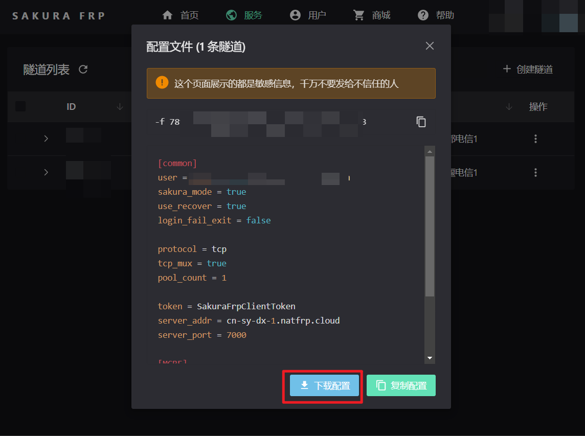

## 配置文件

```json
"FrpClient": {
    "ModuleEnabled": true,
    //覆盖LL的获取IP接口，开启方可让所有使用了LL接口的插件获取到真实IP
    "OverrideLLGetIp": true,
    //FRP的配置文件
    "FrpConfigs": [
        "~\\frpc.ini",//~开头表示插件目录，即PFLP的config.json所在目录
        "frpc2.ini"//不加~表示BDS目录，即[BDS]\frpc2.ini
        //可以多开frp
    ]
}
```

## 使用方法

### 自行搭建的服务

如自行搭建的 frp 服务器地址为`frp.example.com`，端口为`7000`，则配置文件`frpc.ini`如下：

[frp 配置文件格式](https://gofrp.org/docs/features/tcp-udp/)

```ini
[common]
server_addr = frp.example.com
server_port = 7000

[mc19132]
type = udp
local_ip = 127.0.0.1
local_port = 19132
remote_port = 11451
```

### 使用第三方服务

- 这里 SakuraFrp 举例，其他使用[frp](https://github.com/fatedier/frp)的服务商同理
- ##### 点击配置文件


- ##### 下载配置`frpc.ini`



- ##### 修改配置文件
  - 将下载到的`frpc_xxx.ini`放到合适目录，如：`[BDS]\plugins\PixelFaramitaLuminousPolymerization\frpc_xxx.ini`
  - 在 pflp 的 `config.json`对应项`FrpConfigs`添加对应配置，如：`"~\\frpc_xxx.ini"`
  - 控制台输入`pflp reload`重载，即可运行

## 插件对接？？？

只要使用了 LL 接口的插件，不需要专门对接，只要在配置文件开启以下选项即可，其他插件调用 LL 的接口即可获取到真实 IP

- c++ `Player::getIP()`
- c++ `NetworkIdentifier::getIP()`
- js `player.ip`

```json
    //覆盖LL的获取IP接口，开启方可让所有使用了LL接口的插件获取到真实IP
    "OverrideLLGetIp": true
```

## 开源库使用

- [frp repo](https://github.com/fatedier/frp)

- [本插件内置的修改后的分支 repo](https://github.com/LazuliKao/frp)

## 实现原理

- frpc 客户端连接 frps 服务器后，服务端会将连接的 IP 传到 frpc，frpc 将 ip 与内网 ip 存表，故仅需修改客户端即可导出链接真实 IP
- 本插件内置的 frpc 有所改动，方可在 BDS 直接获取到真实 IP，如需参考请打开上文的分支链接
