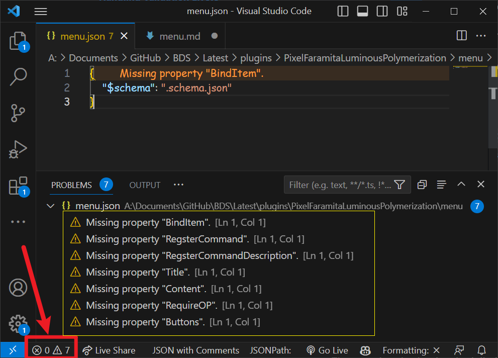
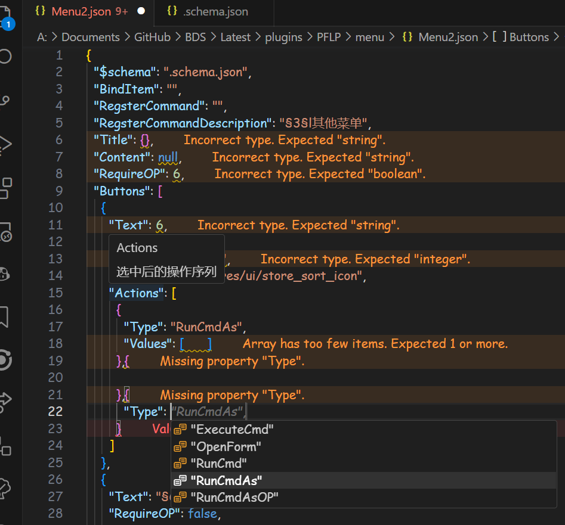

## 配置文件

- `config.json` 全局配置文件

```json
"Menu": {
    "ModuleEnabled": true,//开启
    "SaveFormattedJson": true,//自动保存格式化的json，会导致菜单中的注释消失
    "SaveFormattedJsonWithComments": true//是否在菜单中添加注释（推荐熟悉后自行关闭，不然看起来菜单很长）
}
```

## 菜单配置
- 配置文件在插件目录`menu`文件夹下
- 首次打开文件夹是空的，你需要创建第一个菜单文件，不过不用担心，使用现代IDE（如[Visual Studio Code](https://code.visualstudio.com/)），在没有任何示例的情况下你仍然能很快写出属于自己的菜单
  - 1. 首先在该文件夹下新建一个`菜单名.json`文件，如`menu.json`
  - 2. 然后在文件中粘入以下内容
    ```json
    {
    "$schema": ".schema.json"
    }
    ```
  - 3. 即可看到Visual Studio Code的语法检查自动提示
      
  - 4. 按照提示补全即可
      


- `menu.json`具体配置示例

```json
{
    //绑定物品，如钟，这样玩家使用钟右键即可打开菜单
    "BindItem": "clock",
    //绑定命令，如/menu，这样玩家输入/menu即可打开菜单
    "RegsterCommand": "menu",
    //命令描述
    "RegsterCommandDescription": "§3§lGUI菜单",
    //菜单标题
    "Title": "§7[§6Mc§3play§7]§8--§eGUI菜单",
    //菜单内容
    "Content": "§4§l内容",
    //是否需要OP权限
    "RequireOP": false,
    //按钮列表
    "Buttons": [
      {
        //按钮文本
        "Text": ["►§4§l传送菜单§r◄", "§7[§c进行各种传送§7]"],
        //按钮需要OP权限
        "RequireOP": false,
        //按钮需要的金币数量
        "CostMoney": 0,
        //按钮图标
        "ImageUrl": "textures/ui/world_glyph_color_2x",
        //按钮点击事件，可触发多个回调
        "Actions": [
          {
            //按钮点击事件类型
            //可选：
            //      RunCmd - 在控制台执行命令
            //      RunCmdAs - 以玩家身份执行命令
            //      RunCmdAsOP - 以玩家OP身份执行命令（类比临时提权）
            //      ExecuteCmd - 执行命令，以execute as的方式以玩家身份执行，基本类似RunCmdAsOP
            //      OpenForm - 打开表单
            "Type": "OpenForm",
            "Value": "Tpmenu", //菜单ID
            //点击关闭后是否返回上一级菜单
            "BackOnClose": true
          }
        ]
      },
      {
        "Text": ["►§3§l任务§r◄", "§7[§b奠定发展§7]"],
        "RequireOP": false,
        "CostMoney": 0,
        "ImageUrl": "textures/ui/icon_book_writable",
        "Actions": [
          {
            "Type": "RunCmdAs",
            "Values": ["/task"]
          }
        ]
      },
      {
        "Text": ["►§2§l领地§r◄", "§7[§a保护家园§7]"],
        "RequireOP": false,
        "CostMoney": 0,
        "ImageUrl": "textures/ui/absorption_effect",
        "Actions": [
          {
            "Type": "RunCmdAs",
            "Values": ["/land"]
          }
        ]
      },
      {
        "Text": ["►§6§l系统商店§r◄", "§7[§g赚取金币§7]"],
        "RequireOP": false,
        "CostMoney": 0,
        "ImageUrl": "textures/ui/village_hero_effect",
        "Actions": [
          {
            "Type": "RunCmdAs",
            "Values": ["/shop"]
          }
        ]
      }
    ]
  }
```
