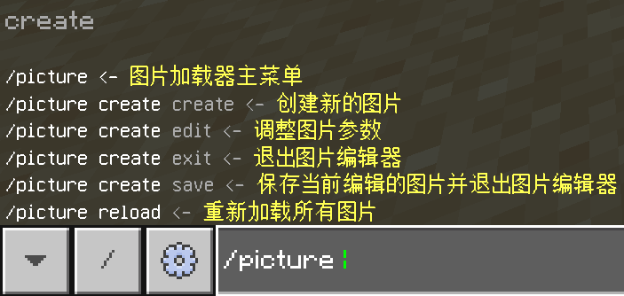
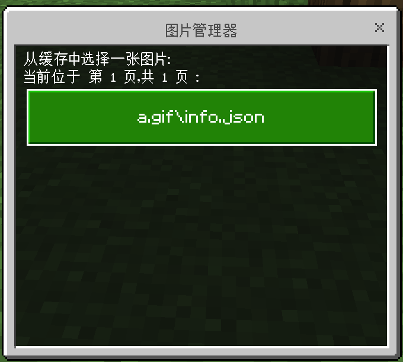

## 配置文件

```json
"PictureLoader": {
    //开启
    "ModuleEnabled": true,
    //图片渲染距离和GIF播放距离
    "DisplayDistance": 20,
    //静态图片（非GIF）重发间隔
    "StaticPictureResendDurationSeconds": 30.0
}
```

## 命令



## 导入图片

- 开始导入
  命令`/picture editor new https://www.baidu.com/img/flexible/logo/pc/result.png`从网址导入图片
  命令`/picture editor new C:\test\xxx.png`从本地路径导入`xxx.png`图片
  命令`/picture editor new xxx.png`从桌面的`xxx.png`导入图片
- 图片属性
  
  `/picture editor edit` 打开此界面
- 设置地址
  `/picture editor set xxx.png`设置新的地址

## 编辑已有图片

- `/picture edit `
  
  
