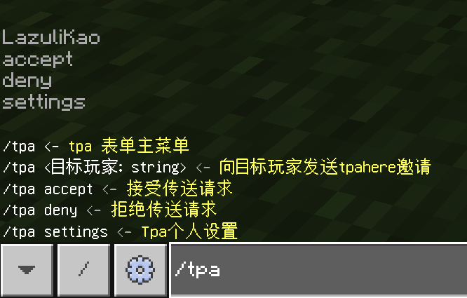

## 配置文件

```json
"Tpa": {
    "ModuleEnabled": true,
    "Timeout": 45.0,//请求超时时间
    "Cooldown": 5.0,//请求冷却时间
    "AllowTpaToSelf": true,//允许自己传送到自己(没什么用）
    "PlayerSettingEnable": true,//是否启用玩家设置
    "TeleportImmuneTime": 5,//传送后无敌时间
    //默认接收方式玩家可以在个人设置中修改
    "DefaultReceiveByToast": true,//默认:横幅
    "DefaultReceiveByForm": true,//默认:弹窗
    "DefaultReceiveByMsg": true//默认:消息
}
```

## 命令



## 个人设置


