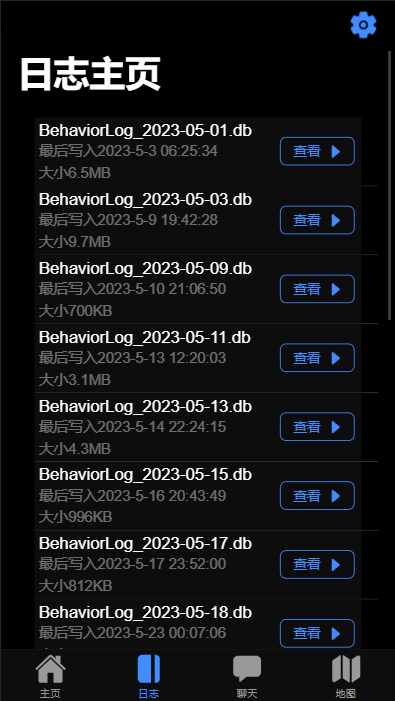
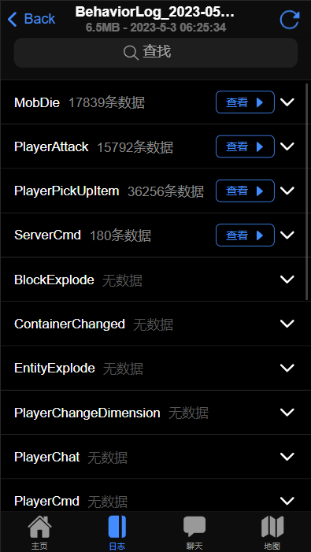
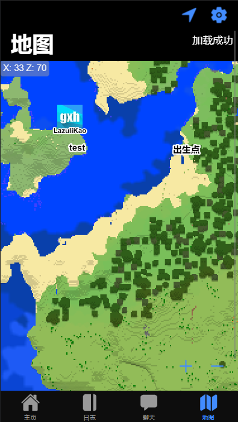

## 配置文件

```json
"WebUI": {
    //开关
    "ModuleEnabled": true,
    //绑定地址，0.0.0.0暴露公网
    "Hostname": "0.0.0.0",
    //绑定端口
    "Port": 8089,
    //使用SSL证书
    "UseSSL": false,
    "SSLCertificatePath": "",
    "SSLCertificatePassword": "",
    //外部访问地址，用于生成头像链接等，建议填上
    "ExternalAddress": "http://localhost:8089",
    //调试模式，控制台会有很多日志，通常不建议开启
    "Debug": false,
    //网站标题
    "HtmlTitle": "网页标题",
    //功能
    "Functions": {
        //日志查询功能
        "LogQuery": true,
        //在线聊天功能
        "OnlineChat": true,
        //在线聊天保留历史记录（重启后保留聊天）
        "PreserveChatHistory": true,
        //在线地图功能(需要同时开启MapService）
        "OnlineMap": true
    }
}
```

## 提示

- OnlineMap 功能需要同时开启 [MapService](map.md)，方可在网页查看地图，否则地图不会时时刷新。

## 图骗

- 主页

  

- 日志查询

  
  
  

- 在线地图

  
  
  

- 在线聊天

  
  

xdm 也可以把用上的图片发评论区
